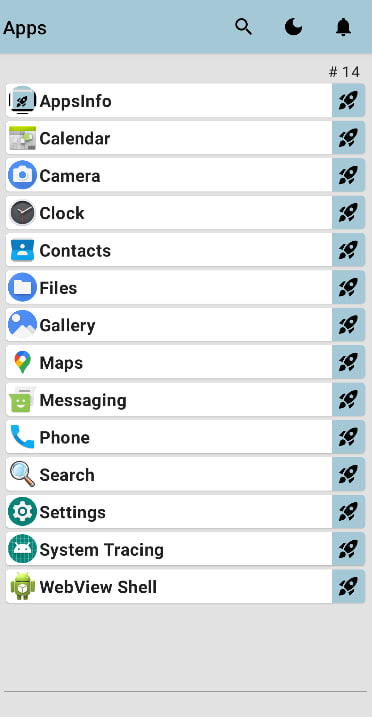

# AppsInfo

This is *Playground* Android application which shows list of all installed apps.

**Features**:
- running apps
- showing separate screen with detailed information about specific app (version, package, SHA-1)
- filtering apps by text (label, package, version) and by installed time
- tracking newly installed apps

It can be considered as example of work with:
- PackageManager
- ForegroundService
- Jetpack Compose
- Decompose + Reaktive
- toggling theme (dark/light) 